# Tópicos

[Limpeza de cena](#limpeza-de-cena)

[Manipulação de Imagens](#manipulação-de-imagens)

[Integrando Elementos](#integrando-elementos)

[Camera Raw](#camera-raw)

[Máscara de Camada](#máscara-de-camada)

[Grafismos Com Pincéis](#criando-grafismos-com-pincéis)

[Aplicar Máscara de Recorte](#aplicar-máscara-de-recorte)

[Capa pra youtube](#capa-pra-youtube)

[Demarcar um objeto](#demarcar-um-objeto)

[Criar um Mockup](#criar-um-mockup)

[Tipografia](#tipografia)

[Thumbnails Photoshop](#thumbnail-photoshop)

[Tipos de Iluminação](#tipos-de-iluminação)

[Enquadramento de Imagens](#enquadramento-de-imagens---regra-dos-terços)

[Efeito Dupla Exposição](#efeito-dupla-exposição)

[Restauração de Foto](#restauração-de-foto)

[Camera RAW - Tratamento de Pele](#camera-raw---tratamento-de-pele)

# Limpeza de Cena

- Ferramenta de seleção 
- Função preencher
- Ferramenta de mascara

Quanto ganhar com
Tratatamento de imagem e manipulação 
Fotografia? 


### Como selecionar uma área da foto e tirar o fundo
1. Ferramenta caneta
2. Clickar com o botão direito Criar seleção 
3. Difusão de 1 px
4. Adicionar máscara de camada
5. Ctrl + i para inverter

### Usar preenchimento com reconhecimento de conteúdo


1. Criar uma seleção (ferramenta laço) em volta da mulher (não precisa ser exata )
2. Editar - preenchimento com reconhecimento de conteúdo 
3. Selecionar as duas - converter em objeto inteligente
4. Arquivo - salvar como - (nome do projeto).PSD

Preenchimento com reconhecimento de conteúdo 
Preenchimento só funciona se a camada for **rasterizada**

Quanto menor a seleção, maior o reconhecimento
Essa remoção gera uma copia da imagem com a mulher (cobertura)

Função pra ser usada com combinação com outras técnicas 


# Manipulação de Imagens

Ferramenta caneta
Demarcadores
Ferramenta selecionar

Quanto posso ganhar com Manipulação de Imagens?

Estudo
Prática 
Aplicação 

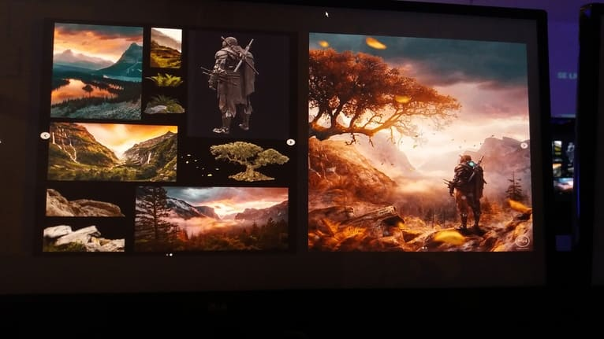

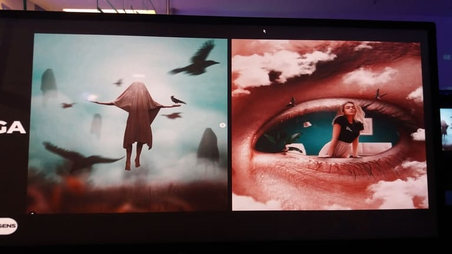

### Perfil de artista no Behance


### Demarcar um objeto

1. Criar uma demarcação com a caneta em volta do objeto
2. Vou na guia demarcadores e salvo
3. Clicla com o botão direito e criar seleção
4. Colocar 1px de difusão 
5. Clicko em mascara para recortar o fundo

Posso converter em objeto inteligente ou copiar e colar em outro arquivo 


# Integrando elementos

### Depois de colocado os elementos na prancheta, preciso pensar na luz

1. Niveis -> exposição 
2. Fazer um filtro de foto Filtro -> filtro de foto 
3. Aumentar a intensidade do filtro de foto 
4. Ferramenta pincel -> Diminuir o fluxo do pincel e passar na borda da lua
5. ferramenta de seleção rápida ou qual preferir
6. Cria uma camada vazia
7. Seleciona em volta da lua
8. Ferramenta pincel
9. Diminui o fluxo
10. Pinta na borda da lua

### O fluxo trabalha na textura do pincel

1. Colocar o cachorro e a menina dentro do grupo
2. Níveis - Escurece 
3. Ir no botao de seta pra baixo
4. Ferramenta pincel -  diminuir bem o tamanho do fluxo - passar em volta do objeto
5. Colocar um filtro de foto no céu em azul e diminuir a intensidade

Para colocar uma foto sem danifica-la arrasto ela e dimensiono segurando o **alt**


# Camera Raw

1. Seleciona todos os grupos e cria una nova camada (**ctrl + alt + shift + e**)
2. Converte pra objeto inteligente
3. Filtro - filtro de camara raw
4. Cria um laço no meio e aplica uma máscara para ver o antes e depois

Luminescencia - intensificacao da luz, suaviza a textura

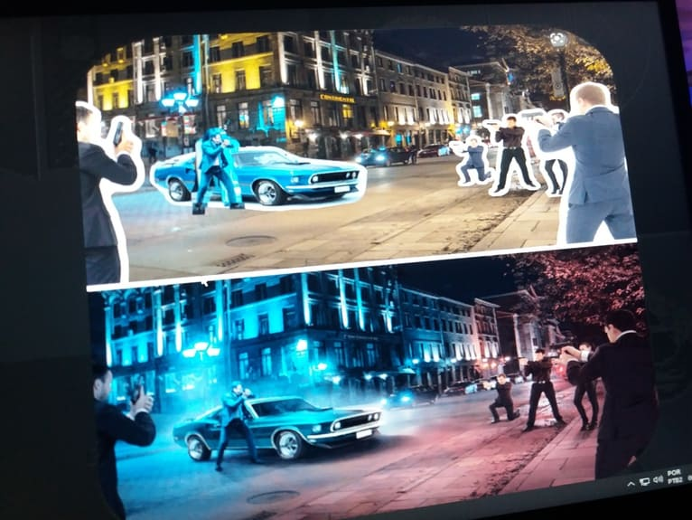


# Máscara de Camada

Ferramenta seleção + máscara 

Cartaz
Banners flayers

Exemplo de valores R$70 a R$120 por artes 
3 artes semanaos a R$120
Faturamento mês = R$1440

Gráfica:
360imprimir

### Aplicar máscara de recorte
Selecionar pincel e colocas as cores preto e branco
O que eu quero **apagar** eu pinto de **preto**
O que eu quero **revelar** eu pinto de **branco**

Banco de imagens
Pixabay 

# Criar um mockup

1. Criar uma forma básica com as medidas da imagem que vou utilizar

2. Converter a forma pra objeto inteligente

3. Criar máscara de recorte e apagar oque sobrar (opcional)

4. Ajustar para caber no meio da camisa

5. Entramos no objeto inteligente e Adicionar imagem

6.Salva e volta

### Simulação 

1. Clickar com o botao direito sobre a imagem Níveis -> escurecer 

2. Esconder o objeto inteligente com a imagem

3. Descartar o nível 

4. Salvar o psd como mapa de mesclagem

5. Revelar o objeto inteligente com a imagem

6. Filtro -> Distorção -> mesclagem -> imagem salva -> 10 x 10

Site pra mockup - freebeez

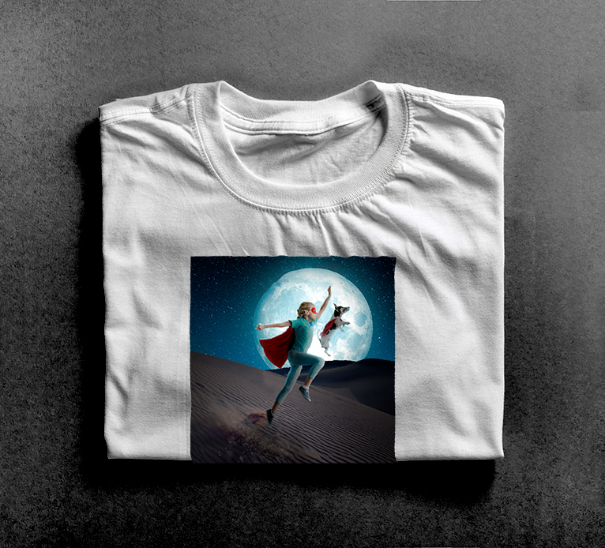

# Tipografia

**font duo** - Combinacao de fonte serifada com sans serif

**Lettering design** - combinação de tipografias feito a mão ou digital

Composicao de social media

**Fotografia de shelkboard** - foto de bebe recém nascico

A partir de R$12 por composição 

**Myfont** - site pago
**Dafont**
**Fontfree** ou **befonts.com**
**Envatoelements** - site pago


### Melhores fontes sans-serif

Montserrat
Roboto
Gotham black
Opens Sans
Helvetica

# Criando grafismos com pincéis

### Utilizado em: 
- Padrões
- Destaque de elementos
- Pós produção de fotografia

Aprenda o básico e entenda quanto poderá ganhar com
- Pintura digitial
- Maquiagem digital
- Tratamento de fotografia

1. Escolher e configurar o pincel pro meu destaque (escolher a cor do meu pincel)
   
2. Pegar a ferramenta caneta e criar uma forma
   
3. Criar uma nova camada pro pincel. O pincel precisa estar em uma nova camada
   
4. Clickar com o direito com a caneta e **Traçar Demarcador**
   
5. Ferramenta pincel, simular pressão 
   
6. Ir na aba demarcadores e excluo o demarcador criado


# Thumbnail Photoshop

Tamanho 1280 x 720


# Capa pra youtube

Tamanho 906,64 mm x 508 mm


# Tipos de Iluminação

Existem dois tipos principais de luz: **Natural** e **Artificial**

A **Luz natural**, é toda iluminação proveniente da natureza, como a **luz do sol** ou **da lua**, por exemplo

A **Luz artificial** é obtida através de **equipamentos** e **acessórios** para fotografia

### LED / Luz Suave

**LED** significa **diodos emissores de luz**. A partir do LED é possível usar:

**SoftBox**: **Luz suave** (É aquela que gera sombras sem contornos nítidos e não é possível dizer exatamente em que ponto essa sombra começa ou termina)### Luz Recorte


### Luz Refletida / Luz Dura

**Umbrella**: **Luz Refletida** (Amplia a capacidade do flash, ele rebate as luzes e a projeta para pontos escuros com delicadeza e neutralidade).

**Ponto**: **Luz Dura** (Ela incide diretamente sobre o objeto fotografado, causando uma sombra bem marcada e nítida).

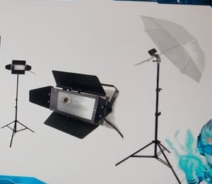

### Outros tipo de luzes


### Contra Luz
### Recorte 3/4


Natural n usa mt equipamento de iluminacao
Studio precisa de uma iluminação artificial

Evitar desfocar a imagem


# Enquadramento de Imagens - Regra dos terços 

Cobrar por hora
Preparar equipamento, ver o clima, verificar com antecedência 

Tamanho de social media
**1080 x 1350**
Banco de imagens
**Pexels.com** 

### Como fazer a regra dos terços no Photoshop

1. Visualizar
   
2. Novo layout de guias
   
3. Colunas - 3
   
4. Linhas - 3
   
5. Medianiz 0
   
6. Visualizar ->Bloquear guias

Ponto principal - Imagem
Ponto secundário - Texto


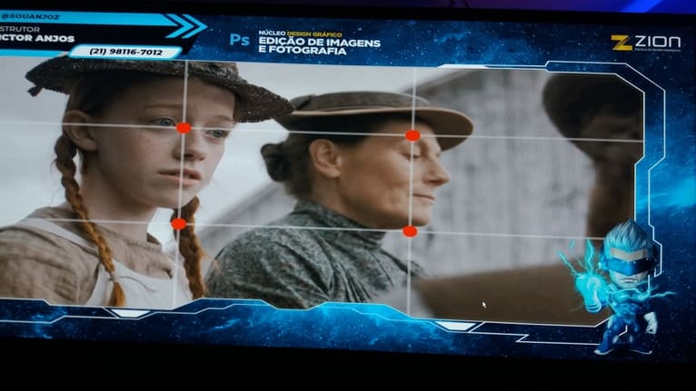


# Ganhar dinheiro com fotografia


# Efeito Dupla Exposição

**Modo de mesclagem** é o modo como a camada superior afeta a camada que está embaixo

O primeiro grupo trabalha com partes **escuras**, escureçendo a imagem
```bash
Escureçer
Multiplicação
Superesposição de Cores
Superesposição Linear
Cor mais escura
```

O segundo grupo trabalha com as partes **claras**, clareando a imagem
```bash
Clarear
Divisão
Subexposição de Cores
Subexposição Linear (Adicionar)
Cor mais clara
```

O terceiro grupo trabalha com os **contraste**, Tanto **clarea** como **escureçe** a imagem

```bash
Sobrepor
Luz Indireta
Luz Direta
Luz Brilhante
Luz Linear
Luz do pino
Mistura Sólida
```

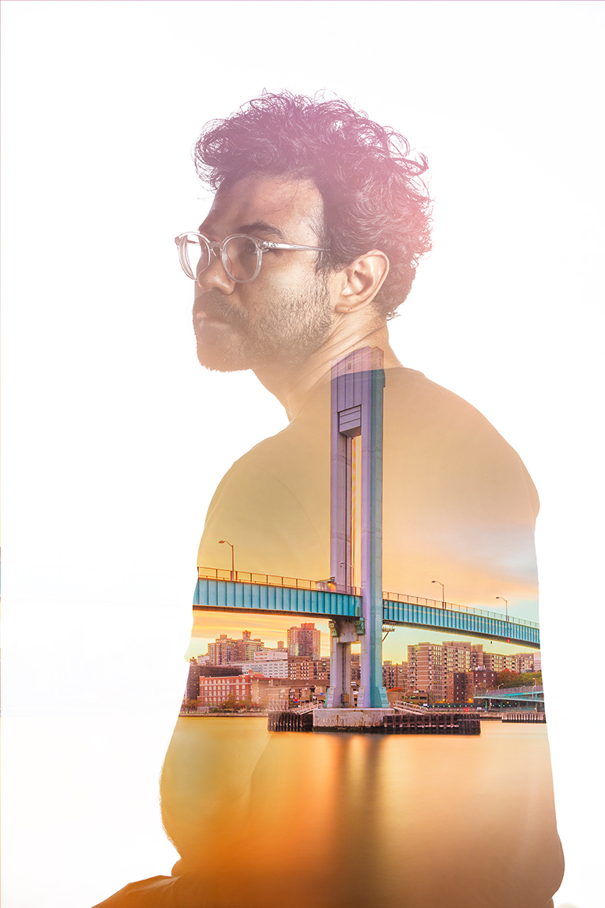


1. Coloque a imagem sobre o objeto
   
2. Transforma a imagem superior em objeto inteligente
   
3. Aplica na imagem superior uma máscara de camada
   
4. Modo de mesclagem -> Escolhe o modo de mesclagem ideal
   
5. Ferramenta pinçel e pinte de preto sobre a máscara de camada para escureçer

# Restauração de Foto

### Passo 1 Remover a coloração amarelada

1. Camada de ajuste -> Matiz/saturação -> Remove toda a saturação
2. Cria um grupo chamado restauração e move tudo lá pra dentro

### Passo 2 Remover as manchas e rasgaduras da fotografia

1. Cria uma nova camada e move ela pra cima. 
   
2. Renomeia a camada pra restauração
   
3. Seleciona a ferramenta pinçel de recuperação ou carimbo
   
4. Muda a configuração de amostras de camada atual para TODAS AS CAMADAS
   
5. Copia a textura que será aplicada apertando o botão ALT + Click do mouse
   
6. Solta o ALT e passa sobre a mancha

### Passo 3 Traz a cor devolta para a imagem

1. Camada de ajuste -> Matiz/saturação -> Selecione a caixinha colorir
   
2. Arraste a cama de Matiz/saturação pra cima
   
3. Ajuste a cor para o tom da pele
   
4. Clicka na máscara matiz/saturação e CRTL + I pra inverter
   
5. Pega o pinçel, selecione a cor branca e pinta a pessoa para revelar as cores
   
6. Se quizer posso criar demarcadores para preencher melhor com o pinçel
   
7. Devo aumentar a opacidade e o fluxo do pincel

Quando for revelar com o pinçel, evite passar no cabelo, olhos, boca, dentes

Se quizer posso criar demarcadores para preencher melhor com o pinçel

### Passo 4 Camera RAW

1. CTRL + SHIFT + ALT + E em todas as camadas
2. Converte em objeto inteligente
3. Filtro -> Camera RAW

### Diferença do carimbro pra pinçel de recuperação

O **Carimbo** faz uma cópia exata da textura
O **Pinçel de recuperação** faz uma cópia da textura mesclando a iluminação, sombra, etc. Trazendo mais suavidade

### Posso criar um grupo chamado Danos e outro chamado cores

A camada cores irá conter todas as camadas de ajuste de cada elemento. Seja ele blusa, cabelo, olhos, maquiagem


# Camera RAW - Tratamento de Pele

Um arquivo **RAW** possui todas as informações que um sensor conseguiu capturar na hora da foto, possibilitando alterar mais detalhadamente no camera raw

### Remover espinhas

1. Abra um arquivo RAW no photoshop
   
2. Ferramenta remoção de mancha
   
3. Click com o botão do mouse na mancha para remove-la
   
4. Click no perfil de cores "Adobe RGB (1998); 8 bit; 400 ..."
   
5. Marcar a opção Abrir no Photoshop como Objetos Inteligentes
   
6. Abrir projeto

### Correção na pele 

1. Faz 2 cópias da imagem RAW por cima dela e renomeia a superior **textura** para e a inferior para **tons** Separa da imagem oque é cor e textura
   
2. Vai na camada tons, filtro -> desfoque -> desfoque glausiano. Coloca o Raio de modo que a imagem perca a textura mais seja indentificável
   
3. Vai na camada textura, botão direito do mouse -> rasterizar camada
   
4. Vai na camada textura, imagem -> aplicar imagem -> camadas: tons; escala:2; deslocamento: 128; opacidade:100%; mesclagem: subtrair. Resultado = Imagem cinza
   
5. Vai na camada textura -> Modo de mesclagem -> Luz Linear

### Outras correções

Posso remover a textura dos locais sem prejudicar as cores da imagem

1. Ferramenta Carimbo
   
2. Coloca só pra visualizar a textura -> Passa com o carimbo sobre a parte a ser removida


### Suavizar a exposição de luz

1. Camada tons -> Duplicar camada
   
2. Rasterizar camada
   
3. Renomeia a camada pra suave
   
4. Ferramenta laço -> passar em volta de áreas que possuem mais luz e sombra ao mesmo tempo
   
5. Difusão do laço bem alta, Ex: 20px
   
6. Filtro -> desfoque glausiano
   
7. Conforme vou aumentando o desfoque, vou suavizando a transição de luz


# Efeito Duotone e Lotes


### Efeito Duotone no Photoshop

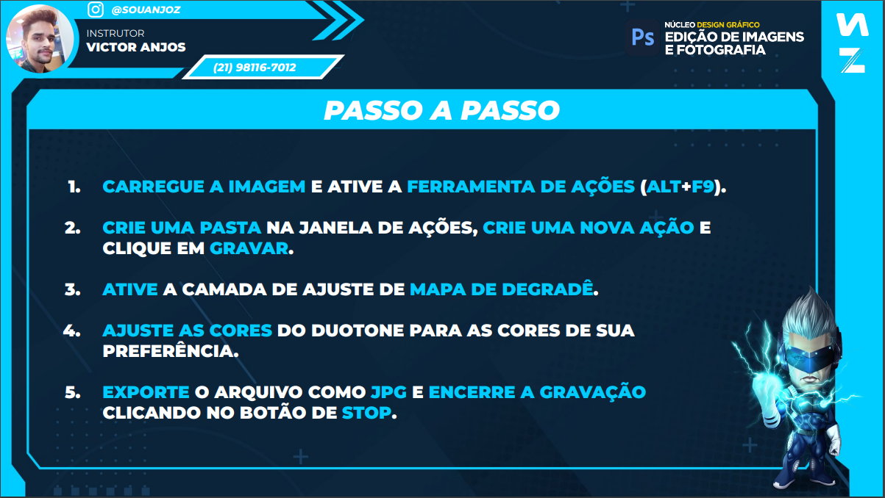

### Painel Ações

**Lote** - conjunto de ações 


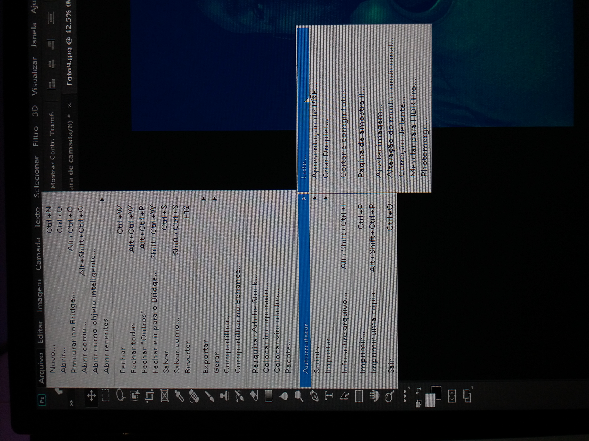

### Automatizar Lotes


# Fotometria

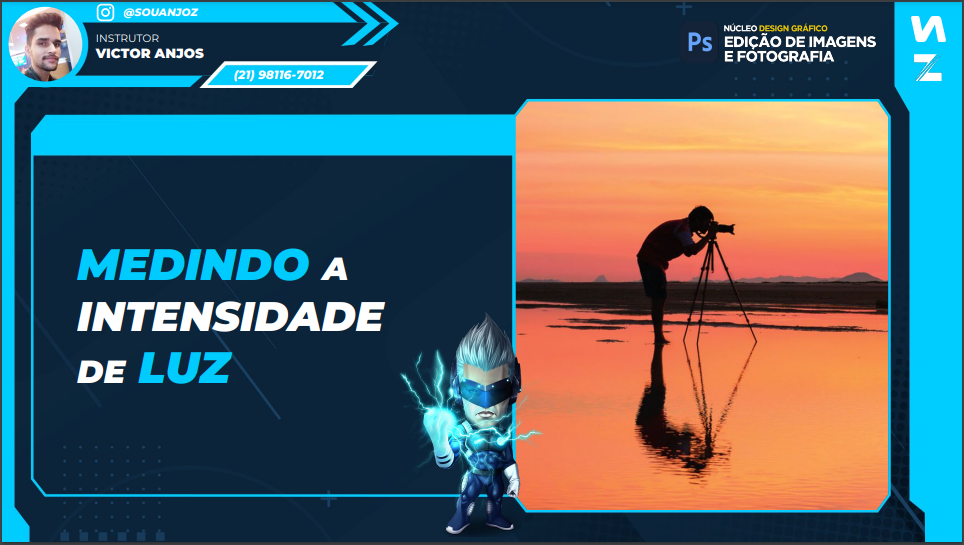

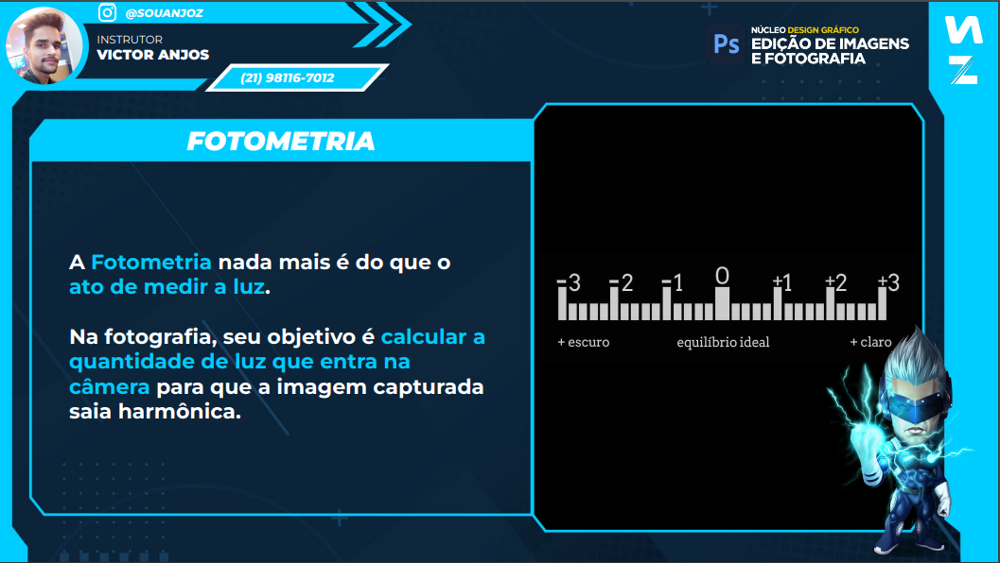

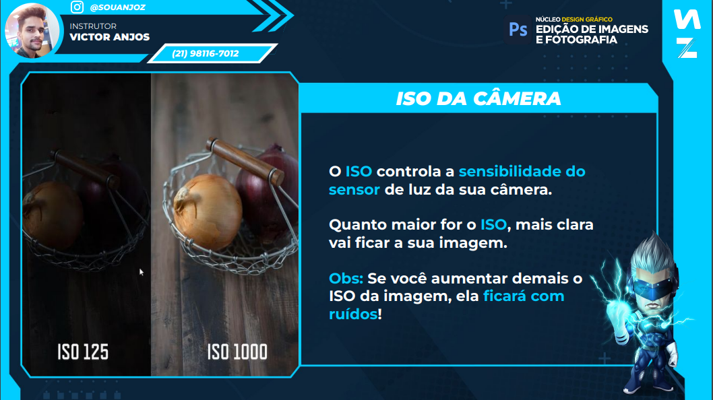

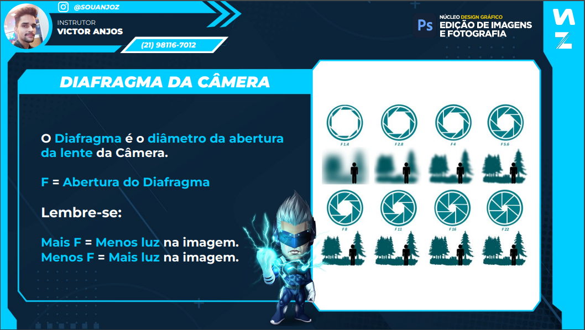


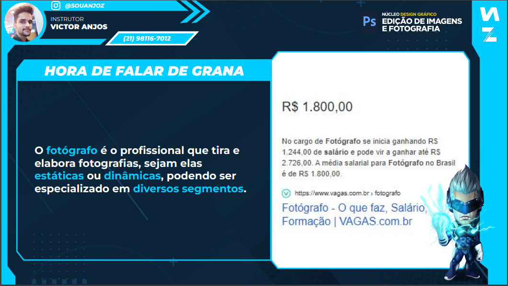


